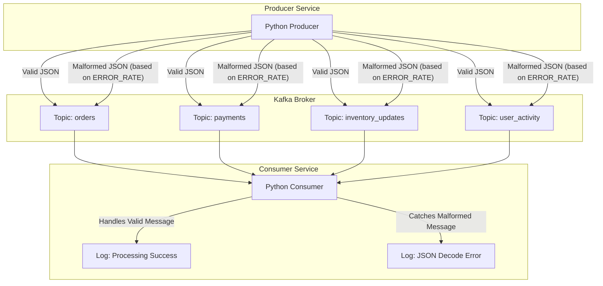

Kafka Observability Demo Stack
==============================

1\. Summary
-----------

This project provides a self-contained, multi-container application stack designed to simulate an e-commerce data stream using Kafka. Its primary purpose is to serve as a hands-on environment for demonstrating and evaluating observability and monitoring tools.

The stack consists of a Python-based **producer** that generates load and simulates errors, a **consumer** that processes messages defensively, and the necessary **Kafka** and **Zookeeper** instances, all orchestrated with Docker Compose.

The producer sends messages to four distinct Kafka topics (`orders`, `payments`, `inventory_updates`, `user_activity`) and can be configured to inject malformed JSON messages to simulate real-world data corruption or producer-side bugs.

2\. Directory Structure
-----------------------

```
.
├── docker-compose.yml
├── producer/
│   ├── producer.py
│   ├── Dockerfile
│   └── requirements.txt
├── consumer/
│   ├── consumer.py
│   ├── Dockerfile
│   └── requirements.txt
└── README.md

```

3\. Signal Flow
---------------

The following diagram illustrates the flow of data and potential errors through the system.



4\. Deployment Steps
--------------------

Follow these steps to deploy the entire stack on a fresh Ubuntu EC2 instance.

**Step 1: Launch and Configure EC2 Instance**

1.  Go to the AWS EC2 console.

2.  Launch a new instance.

    -   **AMI:** Ubuntu 22.04 LTS or newer.

    -   **Instance Type:**  `t3.medium` or larger is recommended.

    -   **Security Group:** Ensure Port `22` (SSH) is open to your IP address.

3.  Connect to your instance via SSH.

**Step 2: Install Git, Docker, and Docker Compose** Run the following commands on your EC2 instance to install Docker Engine and the Docker Compose plugin.

```
# Update package lists
sudo apt-get update

# Install prerequisites
sudo apt-get install -y ca-certificates curl gnupg git

# Add Docker's official GPG key
sudo install -m 0755 -d /etc/apt/keyrings
curl -fsSL https://download.docker.com/linux/ubuntu/gpg | sudo gpg --dearmor -o /etc/apt/keyrings/docker.gpg
sudo chmod a+r /etc/apt/keyrings/docker.gpg

# Set up the repository
echo\
  "deb [arch=$(dpkg --print-architecture) signed-by=/etc/apt/keyrings/docker.gpg] https://download.docker.com/linux/ubuntu \
  $(. /etc/os-release && echo "$VERSION_CODENAME") stable" |\
  sudo tee /etc/apt/sources.list.d/docker.list > /dev/null

# Install Docker Engine and Compose
sudo apt-get update
sudo apt-get install -y docker-ce docker-ce-cli containerd.io docker-buildx-plugin docker-compose-plugin

# Add your user to the 'docker' group to run docker without sudo
sudo usermod -aG docker $USER

# Reload the group for the change to take effect
newgrp docker

```

**Step 3: Clone or Create Project Files** Create the project directory and all the files (`docker-compose.yml`, `producer/*`, `consumer/*`) as specified in the **Directory Structure** section above. You can do this with `git clone` if it's in a repository or by creating the files manually.

**Step 4: Build and Run the Stack** Navigate to the root directory of the project (`kafka-observability-demo/`) and run:

```
# This command builds the producer/consumer images and starts all containers.
docker-compose up --build -d

```

The `-d` flag runs the containers in detached mode.

**Step 5: Verify the Stack is Running** Check the status of the containers:

```
docker-compose ps

```

You should see `zookeeper`, `kafka`, `producer`, and `consumer` with a status of `Up` or `Running`.

To view the live logs from all services, run:

```
docker-compose logs -f

```

5\. How to Use the App
----------------------

The primary way to interact with this demo is by modifying the load and error parameters in the `docker-compose.yml` file.

**Scenario 1: Simulate a Traffic Spike**

1.  Open `docker-compose.yml`.

2.  Find the `producer` service definition.

3.  Change the `MESSAGES_PER_SECOND` environment variable to a higher number (e.g., `100`).

    ```
    # ...
    producer:
      # ...
      environment:
        KAFKA_BROKER: "kafka:29092"
        MESSAGES_PER_SECOND: "100" # Increased from 5 to 100
        ERROR_RATE: "0.1"
    # ...

    ```

4.  Apply the changes by running `docker-compose up -d --build`. Docker Compose will recreate only the `producer` container.

**Scenario 2: Simulate a Faulty Producer**

1.  Open `docker-compose.yml`.

2.  Find the `producer` service definition.

3.  Change the `ERROR_RATE` to a higher value. `0.5` means 50% of messages will be malformed.

    ```
    # ...
    producer:
      # ...
      environment:
        KAFKA_BROKER: "kafka:29092"
        MESSAGES_PER_SECOND: "5"
        ERROR_RATE: "0.5" # Increased from 0.1 to 0.5
    # ...

    ```

4.  Apply the changes by running `docker-compose up -d --build`.

6\. Troubleshooting
-------------------

**Problem: `docker-compose` command not found.**

-   **Solution:** Your installation of Docker may have failed, or you are using an older version. Ensure you have installed `docker-compose-plugin` as part of the Docker Engine installation. The command is now `docker-compose` (with a hyphen), not `docker compose` (with a space).

**Problem: Producer or Consumer logs show "Connection refused" or "NoBrokersAvailable".**

-   **Cause:** This usually means the producer/consumer container started before the Kafka broker was fully ready to accept connections.

-   **Solution 1 (Quick):** Restart the affected containers. `docker-compose restart producer consumer`.

-   **Solution 2 (Robust):** The Python scripts have a built-in retry loop. If the connection fails, they will wait 5 seconds and try again. Check the logs for the `kafka` container (`docker-compose logs kafka`) to see if it's healthy.

**Problem: Containers are exiting immediately.**

-   **Cause:** There is likely an error in one of the Python scripts or a missing dependency.

-   **Solution:** Check the logs of the specific container that is failing. For example, if the `producer` is exiting, run `docker-compose logs producer`. This will show you the Python traceback or error message. Correct the issue in the code or `requirements.txt` and rebuild with `docker-compose up --build -d`.

**Problem: Changes to `MESSAGES_PER_SECOND` or `ERROR_RATE` are not taking effect.**

-   **Cause:** You may have forgotten to re-run the `docker-compose up` command after editing the `docker-compose.yml` file.

-   **Solution:** Run `docker-compose up -d --build`. The `--build` flag isn't strictly necessary for environment variable changes, but it's good practice and ensures the container is recreated with the new configuration.
